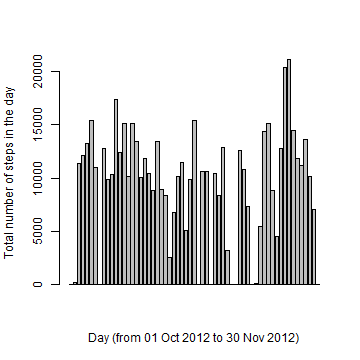
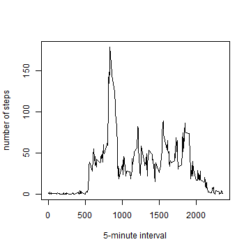
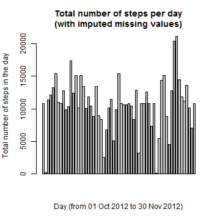
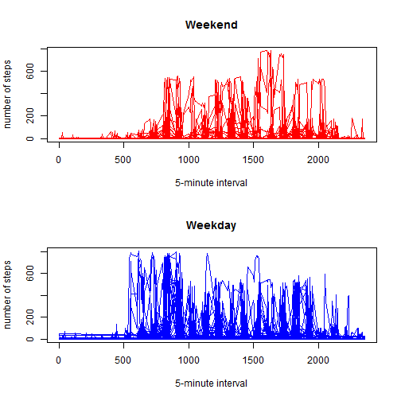

# Introduction

It is now possible to collect a large amount of data about personal movement using activity monitoring devices such as a Fitbit, Nike Fuelband, or Jawbone Up. These type of devices are part of the "quantified self" movement -- a group of enthusiasts who take measurements about themselves regularly to improve their health, to find patterns in their behavior, or because they are tech geeks. But these data remain under-utilized both because the raw data are hard to obtain and there is a lack of statistical methods and software for processing and interpreting the data.

This assignment makes use of data from a personal activity monitoring device. This device collects data at 5 minute intervals through out the day. The data consists of two months of data from an anonymous individual collected during the months of October and November, 2012 and include the number of steps taken in 5 minute intervals each day.

# Data

The data for this assignment was downloaded from the course web site. The variables included in this dataset are:
1. steps: Number of steps taking in a 5-minute interval (missing values are coded as NA)
2. date: The date on which the measurement was taken in YYYY-MM-DD format
3. interval: Identifier for the 5-minute interval in which measurement was taken.

The dataset is stored in a comma-separated-value (CSV) file and there are a total of 17,568 observations in this dataset.

# Assignment

## Loading and Processing data

The data was loaded and the plyr package was loaded as well. 


```r
library(plyr)
activity <- read.csv("activity.csv") 
activity[is.na(activity)]<-0
```

## Part 1: What is mean total number of steps taken per day?

Subsequently they were summarized into the total number of steps per day.


```r
spd<- aggregate(activity$steps, by=list(activity$date), FUN=sum)
names(spd)<-c("date","steps")
```

The sorted data was plotted:

```r
barplot(spd$steps,xlab="Day (from 01 Oct 2012 to 30 Nov 2012)",ylab="Total number of steps in the day")
```

 

The mean total number of steps by day is:


```r
mean(spd$steps)
```

```
## [1] 9354.23
```

The median total number of steps by day is:


```r
median(spd$steps)
```

```
## [1] 10395
```

## Part 2: What is the average daily activity pattern?

The goal is to make a time series plot (i.e. type = "l") of the 5-minute interval (x-axis) and the average number of steps taken, averaged across all days (y-axis). 

To achieve this, the data was sorted into steps by interval (sbi).


```r
sbi<- aggregate(activity$steps, by=list(activity$interval), FUN=mean)
names(sbi)<-c("interval","steps")
```

The sorted data was plotted:

```r
plot(sbi$interval,sbi$steps,type="l",xlab="5-minute interval",ylab="number of steps")
```

 

The 5-minute interval, on average across all the days in the dataset, that contains the maximum number of steps is:

```r
sbi$interval[which(sbi$steps==max(sbi$steps))]
```

```
## [1] 835
```

## Part 3: Imputing missing values

The data was read again, this time, and the number of NA values were identified.


```r
activity2 <- read.csv("activity.csv")
na_act <- is.na(activity2)
na_act_combined <- na_act[,1]+na_act[,2]+na_act[,3]
sum(na_act_combined)
```

```
## [1] 2304
```

Further analysis revealed that only 8 days contained missing values:


```r
spd2<- aggregate(activity2$steps, by=list(activity2$date), FUN=sum)
names(spd2)<-c("date","steps")
na_spd2 <- is.na(spd2)
na_spd2c <- na_spd2[,1]+na_spd2[,2]
sum(na_spd2c)
```

```
## [1] 8
```

We shall replace the missing values by the mean values for the same interval

```r
impute.mean <- function(x) replace(x, is.na(x), mean(x, na.rm = TRUE))
activity3 <- ddply(activity2, ~interval, transform, steps = impute.mean(steps))
activity3<-activity3[order(activity3$date),]
```

We shall assess the revised data set by total number of steps per day.


```r
spd3<- aggregate(activity3$steps, by=list(activity3$date), FUN=sum)
names(spd3)<-c("date","steps")
```

The sorted data was plotted:

```r
barplot(spd3$steps,xlab="Day (from 01 Oct 2012 to 30 Nov 2012)",ylab="Total number of steps in the day")
title("Total number of steps per day\n(with imputed missing values)")
```

 

The mean total number of steps by day with the imputed missing values is:


```r
mean(spd3$steps)
```

```
## [1] 10766.19
```

The median total number of steps by day with the imputed missing values is:


```r
median(spd3$steps)
```

```
## [1] 10766.19
```

Upon imputing the missing data, there is a distinct difference in the graphs - there are less zero values. In addition, the mean and median also increases.

## Part 4: Are there differences in activity patterns between weekdays and weekends?

We shall reorganize the data by weekdays and weekends: 

```r
library(plyr)
dates<-as.Date(activity3[,2], format = "%Y-%m-%d")
activity4<-mutate(activity3, days=weekdays(dates))
weekday <- c("Monday","Tuesday","Wednesday","Thursday","Friday")
weekend <- c("Saturday", "Sunday")
library(dplyr)
```

```
## Warning: package 'dplyr' was built under R version 3.1.2
```

```
## 
## Attaching package: 'dplyr'
## 
## The following objects are masked from 'package:plyr':
## 
##     arrange, count, desc, failwith, id, mutate, rename, summarise,
##     summarize
## 
## The following object is masked from 'package:stats':
## 
##     filter
## 
## The following objects are masked from 'package:base':
## 
##     intersect, setdiff, setequal, union
```

```r
wd_activity<-filter(activity4, days %in% weekday) 
sbi_wd<- aggregate(wd_activity$steps, by=list(wd_activity$interval), FUN=mean)
names(sbi_wd)<-c("interval","steps")
we_activity<-filter(activity4, days %in% weekend)
sbi_we<- aggregate(we_activity$steps, by=list(we_activity$interval), FUN=mean)
names(sbi_we)<-c("interval","steps")
```

Plotting the data gives us insight into the activity patterns between weekdays and weekends.

```r
par(mfrow=c(2,1))
plot(we_activity$interval,we_activity$steps, type="l", col="red", main="Weekend",xlab="5-minute interval",ylab="number of steps")
plot(wd_activity$interval,wd_activity$steps, type="l", col="blue", main="Weekday",xlab="5-minute interval",ylab="number of steps")
```

 


